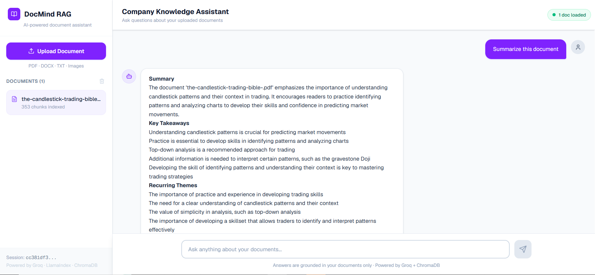

<div align="center">

# 🧠 DocMind RAG
### AI-Powered Document Intelligence Platform

[](https://fastapi.tiangolo.com)
[](https://nextjs.org)
[](https://www.trychroma.com)
[](https://groq.com)
[](LICENSE)

**Upload any document or image → Ask questions in natural language → Get cited, structured answers**

[🚀 Live Demo](https://rag-chatbot-comapny-docs.vercel.app) · [🐛 Report Bug](../../issues)



</div>

---

## ✨ Features

| Feature | Description |
|---|---|
| 📄 **Multi-format upload** | PDF, DOCX, TXT, Markdown, and Images (PNG, JPG, WebP) |
| 🖼️ **Vision AI** | Diagrams and images are described by LLaMA 4 Vision and made searchable |
| 🔍 **Semantic search** | Vector similarity search using sentence-transformers (all-MiniLM-L6-v2) |
| 💬 **Cited answers** | Every answer shows exact source document + page number |
| 🎨 **Formatted responses** | Markdown-rendered answers with headings, bullets, bold |
| 🔒 **Session isolation** | Each user's documents are stored in their own vector namespace |
| ⚡ **Blazing fast inference** | Groq API delivers LLaMA 3.1 responses in under 1 second |
| 🐳 **Docker ready** | One command deploy with docker-compose |

---

## 🏗️ Architecture

```
┌─────────────────────────────────────────────────────┐
│                   Next.js Frontend                   │
│         Upload UI · Chat Interface · Citations        │
└──────────────────────┬──────────────────────────────┘
                       │ REST API
┌──────────────────────▼──────────────────────────────┐
│                  FastAPI Backend                      │
│  ┌─────────────┐  ┌──────────────┐  ┌────────────┐  │
│  │  Ingestion  │  │  Retrieval   │  │    LLM     │  │
│  │  Pipeline   │  │   Engine     │  │  Service   │  │
│  └──────┬──────┘  └──────┬───────┘  └─────┬──────┘  │
│         │                │                │          │
│  ┌──────▼──────┐  ┌──────▼───────┐  ┌────▼──────┐   │
│  │HuggingFace  │  │   ChromaDB   │  │ Groq API  │   │
│  │ Embeddings  │  │ Vector Store │  │ LLaMA 3.1 │   │
│  └─────────────┘  └──────────────┘  └───────────┘   │
└─────────────────────────────────────────────────────┘
```

**RAG Pipeline:**
1. **Ingest** → Parse file → Split into 512-token chunks → Embed with MiniLM → Store in ChromaDB
2. **Retrieve** → Embed query → Cosine similarity search → Top-5 chunks
3. **Generate** → Build context prompt → LLaMA 3.1 via Groq → Stream formatted answer

---

## 🚀 Quick Start

### Prerequisites
- Python 3.10+
- Node.js 18+
- [Groq API key](https://console.groq.com) (free)

### 1. Clone & setup

```bash
git clone https://github.com/tanzeela-16/RAG_Chatbot_ComapnyDocs.git
cd rag-company-docs
```

### 2. Backend

```bash
cd backend
python -m venv venv
source venv/bin/activate  # Windows: venv\Scripts\activate
pip install -r requirements.txt
cp .env.example .env
# Add your GROQ_API_KEY to .env
uvicorn app.main:app --reload --port 8000
```

### 3. Frontend

```bash
cd ../frontend
npm install
npm run dev
```

Open **http://localhost:3000** 🎉

### 4. Docker (alternative)

```bash
# Add your keys to backend/.env first
docker-compose up --build
```

---

## 🔧 Tech Stack

**Backend**
- **FastAPI** — async Python API framework
- **ChromaDB** — local vector database for embeddings
- **LangChain** — document loading and text splitting
- **HuggingFace Sentence Transformers** — free local embeddings (all-MiniLM-L6-v2)
- **Groq API** — ultra-fast LLaMA 3.1 inference (free tier)

**Frontend**
- **Next.js 14** — React framework with App Router
- **Tailwind CSS** — utility-first styling
- **react-markdown** — formatted AI responses

---

## 📁 Project Structure

```
rag-company-docs/
├── backend/
│   ├── app/
│   │   ├── api/            # Route handlers (upload, chat, documents)
│   │   ├── core/           # Config & settings
│   │   ├── services/       # RAG logic (ingestion, retrieval, LLM)
│   │   └── models/         # Pydantic schemas
│   ├── requirements.txt
│   └── Dockerfile
├── frontend/
│   ├── src/
│   │   ├── app/            # Next.js pages
│   │   ├── components/     # Reusable UI components
│   │   └── lib/            # API client
│   └── Dockerfile
├── docker-compose.yml
└── README.md
```

---

## 🌐 Deployment

| Service | Platform | Cost |
|---|---|---|
| Frontend | Vercel | Free |
| Backend | Hugging Face Spaces | Free |
| Vector DB | ChromaDB (persistent in HF Space container) | Free |
| LLM | Groq API | Free tier |

---

## 📄 License

MIT © 2025 — feel free to use this for your own projects!

---

<div align="center">
If this project helped you, please ⭐ star the repo!
</div>